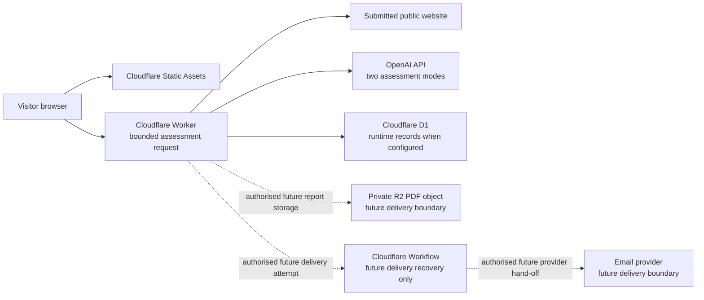

# ShortList architecture map

**Status:** approved MVP 1 architecture baseline; operational boundaries remain
separately evidenced
**Owner:** Chris / SuccessByCS
**Update when:** a service boundary, runtime responsibility, or selected
platform changes.

This is the concise architecture map. The [SDD](../product/SDD.md) is the
application-design narrative, the [architecture decision](../product/ARCHITECTURE_DECISION.md)
records Cloudflare platform choices, and the [data model](DATA_MODEL.md) is the
authoritative logical schema design. D1 migrations and application code are
implementation evidence; they do not define the design.

## Solution architecture dossier

Read these ShortList-specific documents together. They describe the intended
systems and functions, not a claim that every selected component is configured
or live.

| Concern | Architecture authority and diagram/document |
| --- | --- |
| Product intent and visitor needs | [Product brief](../product/PRODUCT_BRIEF.md), [requirements](../product/REQUIREMENTS.md), and [user stories](../product/USER_STORIES.md) |
| Visible user experience | [Website experience brief](../product/design/WEBSITE_EXPERIENCE.md) and its reviewed design artefacts |
| Browser-to-service user journey | [Request flow](../product/REQUEST_FLOW.md), including the request and outcome diagrams |
| Components and journey states | [Software Design Document](../product/SDD.md), including the component and state diagrams |
| Platform and asynchronous-delivery choices | [Architecture decision](../product/ARCHITECTURE_DECISION.md) |
| Data, protected-result access, and recipient isolation | [Data model](DATA_MODEL.md) and [product contracts](../product/CONTRACTS.md) |
| Evidence, safety, and failure boundaries | [Safe assessment design](../product/SAFE_ASSESSMENT_DESIGN.md) and its [failure and recovery matrix](../product/SAFE_ASSESSMENT_DESIGN.md#6-failure-and-recovery-matrix) |
| Build-to-release proof | [Delivery plan](../product/DELIVERY_PLAN.md) and [release workflow](../workflows/RELEASE_WORKFLOW.md) |

The reusable documents in this directory that are labelled **template** or
**deferred** provide engineering-policy guidance. They are not replacements for
the ShortList-specific dossier above and do not establish a live integration.

The public assessment journey is a bounded Worker request. It validates a
domain, captures safe public evidence, requests the approved GEO method from
OpenAI, stores the resulting assessment graph in D1 when configured, and
renders the permitted result. It does not depend on Cloudflare Workflows.

Workflows are selected only for later asynchronous report-delivery retries and
escalation after a delivery attempt exists in D1. R2 is selected only for
private PDF bytes. Neither an R2 object key nor a Workflow ID is an access
credential. The protected active browser journey and recipient relationship
control result access.

No diagram arrow is proof that an external resource is live. Configuration,
deployment, credentials, provider calls, PDFs, email and runtime D1 state need
their own observed evidence and authority.

## Experience traceability

The architecture supports a defined visitor journey; it does not independently
choose the user experience. The [website experience brief](../product/design/WEBSITE_EXPERIENCE.md)
defines the required visible states and accessibility/truthfulness boundaries.
The [request flow](../product/REQUEST_FLOW.md) maps the browser journey to the
assessment request boundaries, and the [SDD](../product/SDD.md) contains the
component and state diagrams that connect the experience to this architecture.

For the protected-result, recipient, consent, and report-delivery relationships
that underpin the confirmation and full-result states, see the
[data model](DATA_MODEL.md) and [product contracts](../product/CONTRACTS.md).

## System functions and status

| System/function | Responsibility in the journey | Design status |
| --- | --- | --- |
| Visitor browser and public website | Collect one public domain, show evidence/limits, obtain separate consent, confirm the masked address, and render the permitted result. | Defined experience; implementation and release evidence are separate. |
| Worker application boundary | Validate admission, coordinate safe retrieval and assessment, enforce protected journey access, and return safe visitor states. | Selected platform boundary; each capability requires its own observed proof. |
| Public-website evidence boundary | Fetch bounded public content, extract evidence, and return an honest insufficient-evidence outcome when warranted. | Defined safety and evidence boundary. |
| AI assessment boundary | Use the approved two-mode method against the evidence-linked buyer questions and retain dated provenance/limitations. | Defined method; model/runtime configuration and live evidence remain separately controlled. |
| D1 application records | Hold customer, assessment, evidence, recipient, consent, result, and delivery records without making a domain an access key. | Approved logical design; implementation/runtime status is tracked separately. |
| Private report and delivery recovery | Store a private PDF, record provider hand-off, and perform bounded retry/escalation through a delivery attempt. | Selected architecture, pending provider and real-boundary implementation/proof. |
