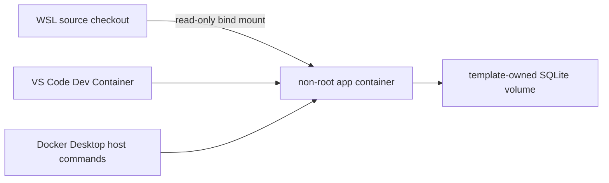
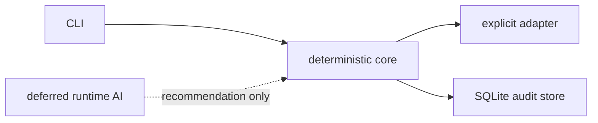

# Architecture

**Status:** active template
**Responsible role:** architect
**Update when:** service boundaries, workflows, or runtime ownership changes.

Business logic belongs in `src/app_template/`; CLI and future web/orchestration layers call it through explicit interfaces. Deterministic code owns limits and external actions. AI, if later enabled, may recommend but never enforce. “No action” is a valid result.

Workflow links: [development](../workflows/DEVELOPMENT_WORKFLOW.md), [planning](../workflows/PLANNING_WORKFLOW.md), [AI changes](../workflows/AI_CHANGE_WORKFLOW.md), [data changes](../workflows/DATA_CHANGE_WORKFLOW.md), [release](../workflows/RELEASE_WORKFLOW.md), [incidents](../workflows/INCIDENT_WORKFLOW.md), and [reconciliation](../workflows/RECONCILIATION_WORKFLOW.md).
