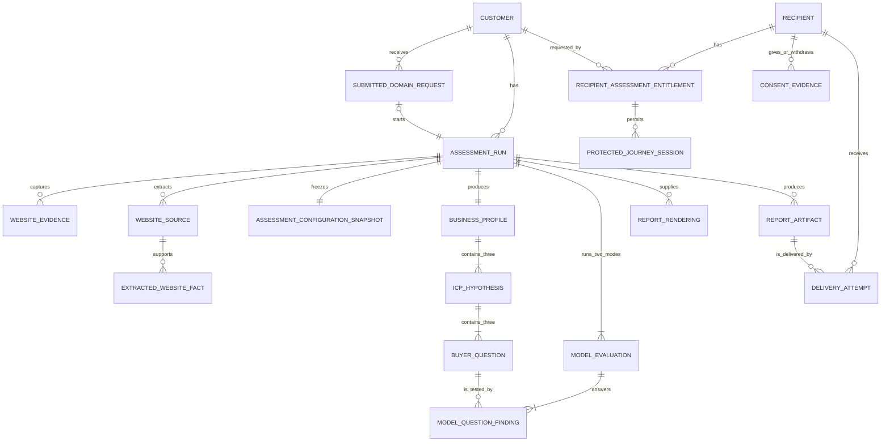

# ShortList data model

**Status:** approved logical-design baseline; deferred-policy register remains
explicitly out of implementation scope until separately decided
**Owner:** Chris / SuccessByCS
**Update when:** a product record, relationship, invariant, privacy class, or
lifecycle rule changes.

## Authority and scope

This is the authoritative **logical schema design** for ShortList. It answers:
what data should exist, why it exists, how it relates, who may use it, and what
rules must always hold.

The documents have distinct jobs:

| Question                                                      | Authority                                                                                 |
| ------------------------------------------------------------- | ----------------------------------------------------------------------------------------- |
| What must the product do?                                     | [Requirements](../product/REQUIREMENTS.md)                                                |
| What records and relationships satisfy that need?             | This document                                                                             |
| What behavioural and access rules apply?                      | [Contracts](../product/CONTRACTS.md)                                                      |
| Which platform boundaries are selected?                       | [Architecture decision](../product/ARCHITECTURE_DECISION.md) and [SDD](../product/SDD.md) |
| How does the approved design currently map to local software? | D1 migrations and TypeScript repository code — implementation evidence only               |
| What exists in a real environment today?                      | Separately observed runtime evidence                                                      |

A D1 migration or a TypeScript type must conform to this design. It does not
silently redefine it. A deployed D1 database is the runtime system of record
for implemented relational data; it is not the design authority.

This design covers the public domain-to-assessment journey and the later
private result/PDF delivery boundary. It does not claim that D1, R2,
Workflows, OpenAI, email, PDFs, or a remote schema are configured or live.

## Status vocabulary

Every entity below has one of these states:

| Status                        | Meaning                                                                               |
| ----------------------------- | ------------------------------------------------------------------------------------- |
| **Approved logical design**   | The entity and its rules are approved here; code may not exist yet.                   |
| **Implemented locally**       | Reviewed local source represents the entity; it is not proof of remote deployment.    |
| **Deployed and observed**     | A real environment has been checked with separately authorised evidence.              |
| **Legacy retained**           | Historical data retained for audit but not used by the current GEO result.            |
| **Deferred / design pending** | The product requires the capability, but its final logical shape is not approved yet. |

## Core concepts

- **Customer:** one business identity represented by its approved normalised
  primary domain. It is never a login, report URL, or access credential.
- **Submitted-domain request:** the raw submitted URL/domain, its validation
  result, canonical/redirect observations, and the relationship to the
  customer identity. It preserves what was actually requested.
- **Assessment run:** one dated attempt to assess a customer using a bounded
  public website input and a frozen methodology/configuration.
- **Evidence:** captured public website material with observation time and
  safe extraction metadata. Evidence is untrusted input, not an instruction.
- **Inference:** an explicitly qualified conclusion produced from identified
  evidence; it must never be represented as a directly observed fact.
- **GEO assessment graph:** the business profile, three ICP hypotheses, nine
  buyer questions, two mode evaluations, and per-question findings for one
  assessment.
- **Recipient:** a private person/email relationship requesting a result. A
  different recipient for the same domain cannot learn another recipient's
  data, consent, report or delivery state.
- **Protected journey session:** a short-lived server-side relationship that
  permits only the active browser journey to reveal a confirmed recipient's
  result. It is not a permanent portal or reusable report secret.

## Logical relationship map

The first block is the current assessment design. The recipient, session,
report-artifact and delivery block is required for the approved MVP journey but
remains partly deferred. It is deliberately separate so a domain cannot be
mistaken for a recipient or an authority to read a report.

## Entity design

### Identity and admission

| Entity                       | Purpose and essential logical attributes                                                                                          | Relationship and invariant                                                                                                                                                          | Classification / access                                                                           | Status                                                                                                                                         |
| ---------------------------- | --------------------------------------------------------------------------------------------------------------------------------- | ----------------------------------------------------------------------------------------------------------------------------------------------------------------------------------- | ------------------------------------------------------------------------------------------------- | ---------------------------------------------------------------------------------------------------------------------------------------------- |
| **Customer**                 | Opaque customer ID; approved normalised primary domain; original accepted submission; creation/reuse time.                        | One customer has many assessment runs. A normalised primary domain identifies at most one customer.                                                                                 | Business identity; Worker/internal operator only. A domain never authorises access.               | Implemented locally: `customers`.                                                                                                              |
| **Submitted-domain request** | Raw submitted value; normalised value; validation/safety outcome; request time; canonical/redirect observation; safe reason code. | May create or reuse one customer and may start at most one run. `www`, redirects and domain changes do not silently merge customer identities: alias/canonical policy remains open. | Public input and operational metadata; browser may see only its own immediate validation outcome. | Approved logical design; implementation deferred until alias/canonical and retention policy are decided.                                       |
| **Assessment run**           | Opaque assessment ID; input URL; UTC trigger/observation time; status; safe reason code; contract/version references.             | Belongs to exactly one customer. A later attempt is a new dated run, not an overwrite.                                                                                              | Product/operational metadata; active confirmed journey or authorised Worker/operator only.        | Implemented locally: `assessment_runs`.                                                                                                        |
| **Admission control**        | Domain lease; bounded concurrency slot; pseudonymous per-IP/day digest; first/last start times and count.                         | Controls are independent of customer and recipient identity. They never grant access to a result.                                                                                   | Pseudonymous security/abuse data; Worker/operator only. Never raw IP.                             | Implemented locally: `assessment_admission_leases`, `assessment_concurrency_slots`, and `assessment_ip_day_limits`; retention policy deferred. |

### Public website evidence and GEO result

| Entity                        | Purpose and essential logical attributes                                                                                           | Relationship and invariant                                                                                                                        | Classification / access                                                                                                                                    | Status                                                                 |
| ----------------------------- | ---------------------------------------------------------------------------------------------------------------------------------- | ------------------------------------------------------------------------------------------------------------------------------------------------- | ---------------------------------------------------------------------------------------------------------------------------------------------------------- | ---------------------------------------------------------------------- |
| **Website evidence / source** | Public URL; observation time; bounded text; title; meta description; extracted JSON-LD; content/extraction outcome and version.    | Belongs to one run. A source may yield many extracted facts. Raw webpage material is untrusted data.                                              | Public-source content that may still contain personal/copyright material; Worker/internal operator and only safe rendered excerpts to a confirmed journey. | Implemented locally: `website_evidence`, `website_sources`.            |
| **Extracted website fact**    | Typed fact value; provenance (`observed` or `inferred`); confidence; source reference.                                             | Must point to its supporting source. Parsing code extracts facts; the database must not execute website content.                                  | Evidence/inference data; Worker/internal operator and safe report renderer.                                                                                | Implemented locally: `extracted_website_facts`.                        |
| **Business profile**          | Evidence-linked business name, services, service-area outcome, audiences, proof points, differentiators, gaps and uncertainty.     | One profile per successful GEO run. Material claims need source IDs or an explicit insufficiency.                                                 | Inferred/model-generated content with linked public evidence.                                                                                              | Implemented locally: `business_profiles`.                              |
| **ICP hypothesis**            | Label; buyer situation; needs; decision criteria; source IDs; confidence; uncertainty.                                             | A successful GEO run has exactly three, ordered 1–3. It is inferred from whom the site copy appears to persuade, not a fixed vertical persona.    | Inference with evidence provenance.                                                                                                                        | Implemented locally: `icp_hypotheses`.                                 |
| **Buyer question**            | Immutable question ID/text; buyer intent; tested claim; question-package version.                                                  | Each ICP has exactly three ordered questions: nine per successful GEO run. The same nine go to both modes.                                        | Model-methodology data and customer assessment content.                                                                                                    | Implemented locally: `buyer_questions`.                                |
| **Model evaluation**          | Mode; approved model/profile; execution time; outcome; safe reason code.                                                           | A completed GEO run has exactly two modes: `current_web` and `model_knowledge`. Each mode evaluates the same questions.                           | Operational/model provenance; Worker/internal operator.                                                                                                    | Implemented locally: `model_evaluations`.                              |
| **Model question finding**    | Answer summary; mention status; description accuracy; recommendation fit; provider sources; content gaps; limitations; confidence. | One finding per evaluation/question pair. Current-web citations prove only what the provider supplied; model-knowledge has no invented citations. | Model-generated inference with mode-specific provenance.                                                                                                   | Implemented locally: `model_question_findings`.                        |
| **Report claim**              | Claim ID; rendered text/value; observed/inferred/insufficient kind; evidence/finding IDs; contract version; render outcome.        | Every material customer-facing assertion must map to evidence or qualified inference.                                                             | Customer-facing derived content.                                                                                                                           | Approved logical design; report-view-model reconciliation is deferred. |
| **Report rendering**          | Versioned report view model; rendering kind; template version; result/outcome; time.                                               | A renderer consumes stored assessment data and does not trigger another AI call. Web and PDF use the same logical content.                        | Derived customer content; access depends on protected journey/recipient relationship.                                                                      | Implemented locally: `report_renderings`; final PDF boundary deferred. |

### Versioned methodology and provider provenance

| Entity                              | Purpose and essential logical attributes                                                                                                           | Relationship and invariant                                                                                                                                     | Classification / access                                                                      | Status                                                                                                                                                                   |
| ----------------------------------- | -------------------------------------------------------------------------------------------------------------------------------------------------- | -------------------------------------------------------------------------------------------------------------------------------------------------------------- | -------------------------------------------------------------------------------------------- | ------------------------------------------------------------------------------------------------------------------------------------------------------------------------ |
| **Prompt package/version/template** | Package key; lifecycle; reviewed stage instructions; allowed fields; input/output schema versions; prohibited claims; checksum; approval metadata. | Approved versions/templates are immutable. A correction creates a new version; it never rewrites a previous run.                                               | Product methodology; Worker/internal operator. Never arbitrary browser-selected prompt text. | Implemented locally: `geo_prompt_packages`, `geo_prompt_package_versions`, and `geo_prompt_stage_templates`. The human-readable prompt package remains design authority. |
| **Model test profile**              | Provider/model ID; mode; permitted tool configuration; budget/timeout policy reference; lifecycle/version.                                         | A profile selects only a code-approved provider/tool allowlist.                                                                                                | Operational configuration; Worker/internal operator. Never a secret.                         | Implemented locally: `model_test_profiles`.                                                                                                                              |
| **Market profile**                  | Global/approved geography; timezone; vertical constraints; current-web context; reference-data version; lifecycle/version.                         | A run snapshots an approved profile. Missing location evidence stays uncertain.                                                                                | Product methodology.                                                                         | Implemented locally: `market_profiles`.                                                                                                                                  |
| **Configuration snapshot**          | Selected prompt package, both mode profiles, market profile, evidence-policy version and report-template version.                                  | Exactly one snapshot per run; it makes a result reconstructable.                                                                                               | Assessment methodology/provenance.                                                           | Implemented locally: `assessment_configuration_snapshots`.                                                                                                               |
| **Prompt execution record**         | Stage, safe typed inputs, rendered prompt, structured output or redacted reference, provider configuration, tokens/cost, timeout/outcome and time. | Belongs to one run and one approved stage template. It must never retain API keys, raw IPs, headers, cookies, reusable tokens, or unbounded provider payloads. | Sensitive operational/model data; Worker/internal operator only. Retention decision pending. | Implemented locally: `prompt_execution_records`; exact output-retention policy deferred.                                                                                 |

### Private recipient, report and delivery design

| Entity                                         | Purpose and essential logical attributes                                                                                                               | Relationship and invariant                                                                                                                              | Classification / access                                                                               | Status                                            |
| ---------------------------------------------- | ------------------------------------------------------------------------------------------------------------------------------------------------------ | ------------------------------------------------------------------------------------------------------------------------------------------------------- | ----------------------------------------------------------------------------------------------------- | ------------------------------------------------- |
| **Recipient**                                  | Opaque recipient ID; normalised email lookup value; protected display/contact value; customer relationship.                                            | One recipient may request multiple domain assessments under the product policy. Email is personal data, not a customer key.                             | Personal data; Worker/internal operator only. Storage protection approach and retention are pending.  | Approved logical design; deferred implementation. |
| **Recipient-assessment entitlement**           | Recipient ID; assessment/customer relationship; lifetime allowance decision; duplicate/resend/exhausted outcome; server-only allowlist decision; time. | The recipient/domain combination is idempotent. A repeat request does not create a new assessment or consume another allowance.                         | Personal/operational data; never revealed across recipients.                                          | Approved logical design; deferred implementation. |
| **Consent evidence**                           | Separate delivery and optional marketing purpose; copy/policy version; collection time/context; affirmative/withdrawn outcome.                         | Delivery consent is independent from marketing consent. Confirmation is intentional-address confirmation, not proof of mailbox ownership.               | Personal/compliance data; Worker/internal operator only.                                              | Approved logical design; deferred implementation. |
| **Protected journey session**                  | Opaque random reference; protected server-side representation; assessment/recipient/confirmation relationship; expiry; outcome.                        | It is short-lived and scoped to one active browser journey. It cannot become a report portal or transferable credential.                                | Security/session data; Worker validates it; browser receives only protected cookie/session behaviour. | Approved logical design; deferred implementation. |
| **Report artefact / private object reference** | Report version; PDF rendering relationship; private object reference/version/integrity details; creation/outcome time.                                 | It is distinct from a report view model and delivery attempt. An R2 object key is never public or an access credential.                                 | Private customer content; Worker/authorised delivery adapter only.                                    | Approved logical design; deferred implementation. |
| **Delivery attempt**                           | Stable attempt/idempotency key; recipient/report relationship; state transitions; retries; provider acceptance reference; terminal/escalation outcome. | One logical attempt has bounded retries. Provider acceptance is not proof of inbox reading. A Workflow may recover it later but is never authoritative. | Personal/operational data; Worker/internal operator only.                                             | Approved logical design; deferred implementation. |
| **Operator alert / support event**             | Safe reason code; occurrence/outcome; minimal operational reference; support/deletion request lifecycle.                                               | No recipient content, raw IP, credentials or stack trace. Alert failure never changes the customer outcome.                                             | Operational metadata; internal operator only.                                                         | Approved logical design; deferred implementation. |

### Legacy data

| Entity                 | Purpose                                                | Rule                                                                                                               | Status                          |
| ---------------------- | ------------------------------------------------------ | ------------------------------------------------------------------------------------------------------------------ | ------------------------------- |
| **Legacy AI evidence** | Historical generic comparable-business search records. | Retain for audit. It cannot be used to create a new GEO assessment or claim to represent the nine-question method. | Legacy retained: `ai_evidence`. |

## Non-negotiable invariants

1. One approved normalised primary domain identifies at most one customer;
   the domain is never an access credential.
2. Every assessment run belongs to exactly one customer and preserves its dated
   input/outcome rather than overwriting a previous run.
3. A successful GEO assessment has exactly three ICP hypotheses and exactly
   three buyer questions for each ICP.
4. The same nine questions are evaluated in exactly two modes: current-web and
   model-knowledge.
5. Every material report claim is observed evidence or explicitly qualified
   inference with supporting record IDs; unsupported claims are rejected.
6. Approved prompt versions/templates are immutable. New methodology creates a
   new version and never changes prior-result meaning.
7. Delivery consent and marketing consent are separate records and choices.
8. A recipient cannot learn another recipient's identity, consent, entitlement,
   attribution, report, object reference, or delivery state.
9. A domain, report ID, R2 object key, Workflow ID, or provider reference is
   never a public access credential.
10. The synchronous assessment is a bounded Worker request. A future Workflow
    may only coordinate delayed delivery recovery after a D1 delivery attempt
    exists; it does not orchestrate the assessment.

## Data classification and access

| Classification             | Examples                                                 | Browser access                                                                | Internal/Worker access                                    |
| -------------------------- | -------------------------------------------------------- | ----------------------------------------------------------------------------- | --------------------------------------------------------- |
| Public website evidence    | URL, public title, bounded excerpt, JSON-LD              | Only safe report excerpts in the active confirmed journey                     | Worker and authorised operator                            |
| Inference/model content    | Profile, ICP, findings, limitations, report claims       | Only active confirmed journey's permitted result                              | Worker and authorised operator                            |
| Personal data              | Email, consent, entitlement, delivery and support data   | Never another recipient's data; only masked/authorised active-journey display | Worker and authorised operator                            |
| Pseudonymous security data | Per-day IP HMAC, lease/concurrency outcome               | No                                                                            | Worker and authorised operator                            |
| Operational metadata       | Reason codes, retries, provider reference, alert outcome | Only approved truthful customer wording                                       | Worker and authorised operator                            |
| Secret                     | API keys, raw IP, headers, cookies, reusable tokens      | Never                                                                         | Not stored in D1; deployment secret/runtime boundary only |

## Lifecycle, retention and open policy register

The following are deliberately unresolved; no implementation may invent an
answer without updating this design and the relevant requirements/contracts.

| Decision still needed                                                | Why it matters                                                                   |
| -------------------------------------------------------------------- | -------------------------------------------------------------------------------- |
| Domain alias/canonical/redirect policy                               | Avoids silently merging independent business identities.                         |
| Email storage protection and lookup approach                         | Email is personal data and needs a deliberate protected-storage design.          |
| Evidence, prompt, model-output and report retention/deletion periods | Website content and provider output may contain personal or copyrighted content. |
| Deletion request, hold, completion and audit lifecycle               | Enables a real deletion path without corrupting assessment provenance.           |
| Recipient entitlement, resend and session expiry values              | Determines isolation, support and abuse behaviour.                               |
| Report claim ledger versus report view-model shape                   | Prevents two competing provenance models.                                        |
| R2 object metadata, delivery state and Workflow linkage              | Keeps PDF bytes, delivery state and durable retries separate and private.        |
| Admission/abuse record retention                                     | Preserves protection while minimising pseudonymous security data.                |

## Implementation-conformance register

The following is a map of local implementation evidence, not a replacement for
the approved design and not proof of remote deployment.

| Logical area                                           | Local implementation evidence                                                                                    | Conformance state                                                                                                                                     |
| ------------------------------------------------------ | ---------------------------------------------------------------------------------------------------------------- | ----------------------------------------------------------------------------------------------------------------------------------------------------- |
| Customer/run/website evidence                          | `apps/web/migrations/0001_assessment_core.sql`; assessment repository                                            | Implemented locally; remote state unobserved.                                                                                                         |
| Legacy generic AI evidence                             | `apps/web/migrations/0003_ai_evidence.sql`                                                                       | Legacy retained.                                                                                                                                      |
| Admission/rate controls                                | `0004_assessment_admission_limits.sql`, `0005_raise_testing_ip_day_limit.sql`, `0007_use_utc_rate_limit_day.sql` | Implemented locally; retention design pending. `assessment_ip_day_limits_next` is migration-only replacement machinery, not a logical product record. |
| GEO methodology/result graph                           | `0006_geo_assessment_foundation.sql`, `0008_seed_geo_assessment_v1.sql`, GEO repository/types                    | Implemented locally; remote state unobserved.                                                                                                         |
| Recipient/consent/session/report-object/delivery/alert | Requirements and contracts only                                                                                  | Deferred / design pending implementation.                                                                                                             |

## Change control

Before adding or changing any migration, repository type, or runtime record
handling, update and approve the relevant logical entity, relationship,
invariant, lifecycle and privacy classification here. Then implement a
conforming migration and tests. If code and this document disagree, record an
implementation defect or a proposed design change; do not let code silently
win.
