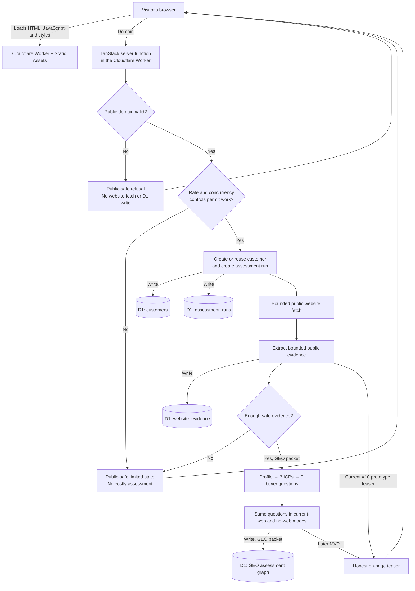
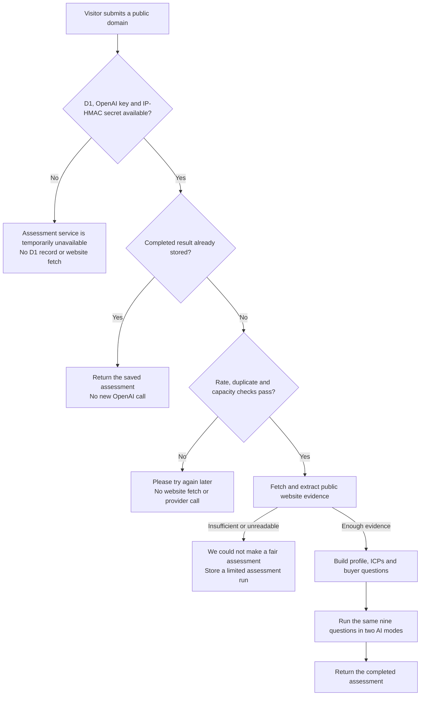

# ShortList request flow

This document explains, in ordinary language, what happens when someone asks
ShortList to assess a business website. It distinguishes what is already
implemented in the current Issue #10 work from later MVP 1 capabilities.

The browser never receives a database binding, an OpenAI key, or access to
another customer's assessment.

Turnstile is deliberately deferred until MVP 3+. MVP 1 uses server-side domain
validation, safe retrieval rules, an active-domain lease, global concurrency
limits, and a privacy-minimised IP/day limit instead.

For the release test matrix and the conditions required before MVP 1 can be
called done, see [MVP1_RELEASE_TEST_PLAN.md](MVP1_RELEASE_TEST_PLAN.md) and
[MVP1_DEFINITION_OF_DONE.md](MVP1_DEFINITION_OF_DONE.md).

This is the customer journey and system-boundary view. A change to this journey
becomes a public release only through the [ShortList Release Workflow](../workflows/RELEASE_WORKFLOW.md):
it requires scoped evidence, human review, explicit authorization, target
verification, and real-boundary proof. The release workflow does not replace
the product requirements or this journey definition.

## Domain-assessment request

## Live request outcomes

The page must not treat every unsuccessful request as a website-evidence
problem. The server can stop at several earlier boundaries, each with a
different honest message for the visitor.

### Current diagnostic finding

On 2026-10-06, a real Green Gecko submission displayed the public
limited-evidence page, but the deployed D1 database contained no customer,
assessment-run, website-evidence or AI-evidence row. That proves the request
stopped before website retrieval and is **not** evidence that the Green Gecko
website lacks public content.

The browser now keeps these distinct server results separate:

- `assessment_unavailable` — a required Worker runtime dependency was absent
  or an internal boundary failed;
- `admission_rejected` — the duplicate, rate or concurrency control refused
  the request;
- `limited` — a genuine website or AI evidence limit.

The next implementation packet must preserve the server controls and map these
states to their matching visitor message. Until that change is deployed, the
limited-evidence screen cannot be used to diagnose an entry-path failure.

## What each technology does

| Piece | Responsibility | Does it hold private data? |
|---|---|---|
| Browser | Shows the page and collects the domain. | No secrets or database access. |
| Cloudflare Static Assets | Serves the ShortList page and its JavaScript. | No customer-record decision. |
| TanStack server function | The private application boundary: validates the domain, applies admission/control rules, coordinates the assessment, and returns a deliberately narrow result. | Yes; it can use Worker bindings and secrets. |
| Cloudflare D1 | The relational system of record for customers, assessment runs, and evidence. | Yes; it is not publicly queryable by domain name. |
| Public business website | Supplies public page content only after the safe-fetch rules allow it. | It is treated as untrusted input. |
| AI provider (GEO packet) | Produces a profile/ICP/question package and two separately labelled evaluations of the same questions after approved evidence and cost controls. | Its API key remains server-side. |

## Database writes for the current assessment path

After domain validation and admission controls pass, the current server path
will make these writes, in order:

1. **`customers`** — creates one record for a new normalised domain, or reuses
   its existing record. A domain is an identifier, never an access key.
2. **`assessment_runs`** — creates a new, UTC-dated run for this request.
3. **`website_evidence`** — records bounded public evidence or an honest
   reason code when a safe fetch/extraction cannot produce evidence.
4. **`assessment_runs`** — updates the run to `preview_ready` or a limited
   outcome with its reason code.

An invalid domain or refused abuse-control decision
must stop before these assessment writes and before any public website fetch.

## What is intentionally later

The following remain separate MVP 1 packets and are not implied by the domain
request alone:

- email capture, confirmation, consent and the three-per-email entitlement;
- PDF rendering, private R2 storage and email delivery;
- Discord alerting for a limited-evidence case;
- the configurable GEO prompt package, model evaluations and cost recording;
- a public deployment at `shortlist.successbycs.com`.

Those later components will extend the same assessment record rather than
creating a second source of truth. The approved architecture decision is in
[`ARCHITECTURE_DECISION.md`](ARCHITECTURE_DECISION.md), and the record shapes
are defined in [`CONTRACTS.md`](CONTRACTS.md). The full connected system,
function, data, safety, delivery, and release documentation is indexed by the
[solution architecture map](../architecture/ARCHITECTURE.md).
