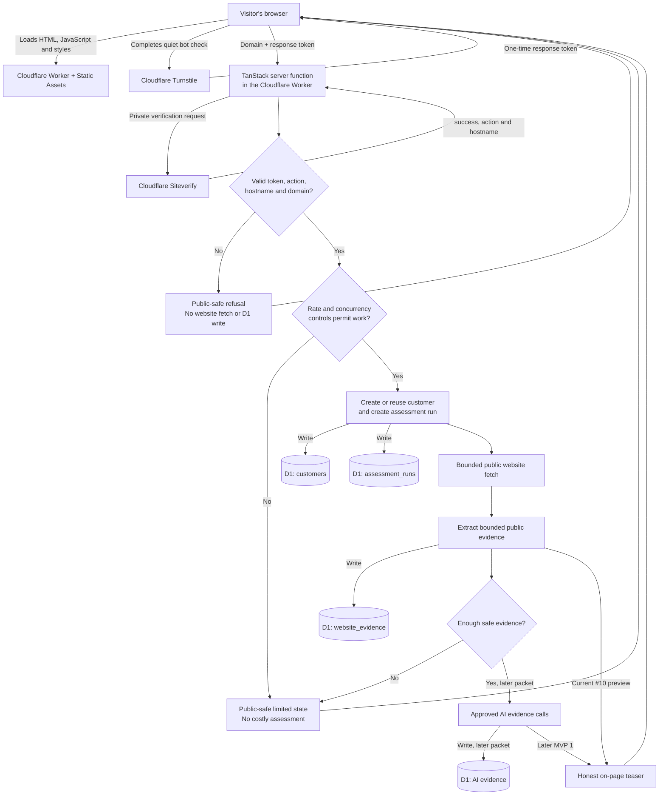
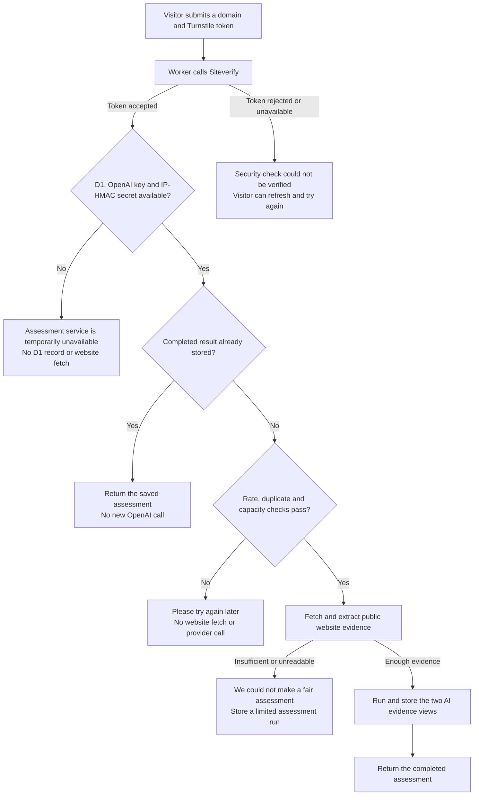

# ShortList request flow

This document explains, in ordinary language, what happens when someone asks
ShortList to assess a business website. It distinguishes what is already
implemented in the current Issue #10 work from later MVP 1 capabilities.

The browser never receives a database binding, an OpenAI key, the private
Turnstile secret, or access to another customer's assessment.

## Domain-assessment request

## Live request outcomes

The page must not treat every unsuccessful request as a website-evidence
problem. The server can stop at several earlier boundaries, each with a
different honest message for the visitor.

### Current diagnostic finding

On 2026-10-06, a real Green Gecko submission displayed the public
limited-evidence page, but the deployed D1 database contained no customer,
assessment-run, website-evidence or AI-evidence row. That proves the request
stopped before website retrieval and is **not** evidence that the Green Gecko
website lacks public content.

The current browser route incorrectly maps these distinct server results to the
same limited-evidence screen:

- `verification_failed` — Siteverify did not accept the submitted token;
- `assessment_unavailable` — a required Worker runtime dependency was absent
  or an internal boundary failed;
- `admission_rejected` — the duplicate, rate or concurrency control refused
  the request;
- `limited` — a genuine website or AI evidence limit.

The next implementation packet must preserve the server controls and map these
states to their matching visitor message. Until that change is deployed, the
limited-evidence screen cannot be used to diagnose an entry-path failure.

## What each technology does

| Piece | Responsibility | Does it hold private data? |
|---|---|---|
| Browser | Shows the page, collects the domain, and receives a short-lived Turnstile response. | No secrets or database access. |
| Cloudflare Static Assets | Serves the ShortList page and its JavaScript. | No customer-record decision. |
| Cloudflare Turnstile | Helps distinguish a real visitor from automated traffic. | Its private verification secret stays server-side. |
| TanStack server function | The private application boundary: verifies Turnstile, applies admission/control rules, coordinates the assessment, and returns a deliberately narrow result. | Yes; it can use Worker bindings and secrets. |
| Cloudflare Siteverify | Confirms that a submitted Turnstile response is valid once, for the right action and hostname. | Receives the private secret only from the server function. |
| Cloudflare D1 | The relational system of record for customers, assessment runs, and evidence. | Yes; it is not publicly queryable by domain name. |
| Public business website | Supplies public page content only after the safe-fetch rules allow it. | It is treated as untrusted input. |
| AI provider (later) | Produces the two separately labelled AI evidence modes after approved evidence and cost controls. | Its API key remains server-side. |

## Database writes for the current assessment path

After the bot check and other admission controls pass, the current server path
will make these writes, in order:

1. **`customers`** — creates one record for a new normalised domain, or reuses
   its existing record. A domain is an identifier, never an access key.
2. **`assessment_runs`** — creates a new, UTC-dated run for this request.
3. **`website_evidence`** — records bounded public evidence or an honest
   reason code when a safe fetch/extraction cannot produce evidence.
4. **`assessment_runs`** — updates the run to `preview_ready` or a limited
   outcome with its reason code.

An invalid domain, failed Turnstile check, or refused abuse-control decision
must stop before these assessment writes and before any public website fetch.

## What is intentionally later

The following remain separate MVP 1 packets and are not implied by the domain
request alone:

- email capture, confirmation, consent and the three-per-email entitlement;
- PDF rendering, private R2 storage and email delivery;
- Discord alerting for a limited-evidence case;
- live AI evidence collection and cost recording;
- a public deployment at `shortlist.successbycs.com`.

Those later components will extend the same assessment record rather than
creating a second source of truth. The approved architecture decision is in
[`ARCHITECTURE_DECISION.md`](ARCHITECTURE_DECISION.md), and the record shapes
are defined in [`CONTRACTS.md`](CONTRACTS.md).
