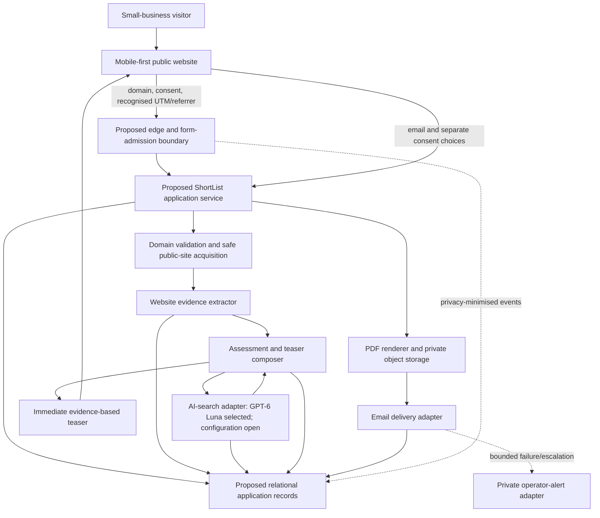
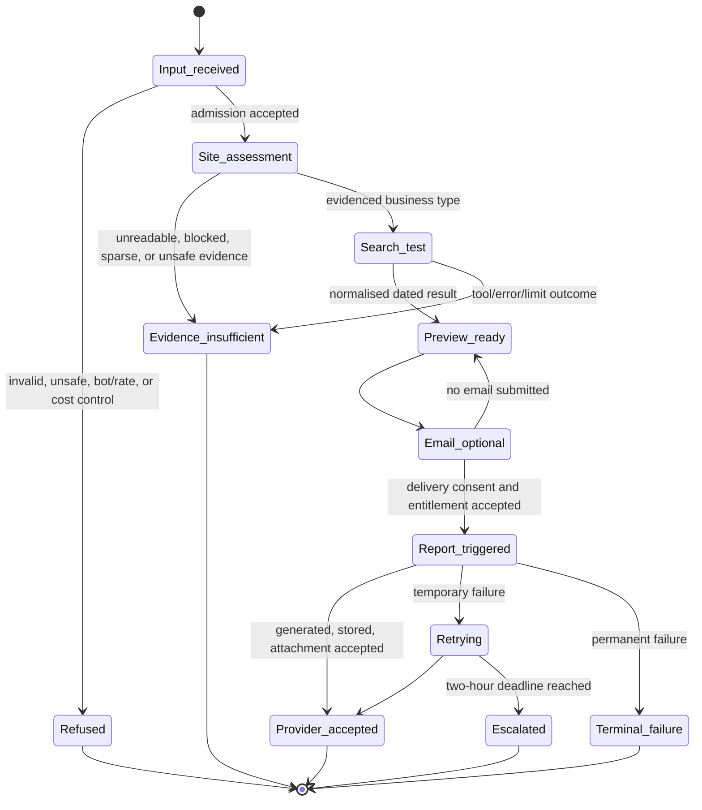

# ShortList MVP 1 software design document

**Status:** design baseline for review; no service is configured or deployed  
**Owner:** Chris / SuccessByCS  
**Design Issue:** [#6](https://github.com/successbycs/ShortList/issues/6)  
**Canonical requirements:** [REQUIREMENTS.md](REQUIREMENTS.md)

## 1. Purpose and scope

This Software Design Document (SDD) translates the approved MVP 1 requirements
into a proposed, testable product design. It is a boundary document, not source
code, a provider configuration, an account setup guide, or authority to contact
customers.

ShortList's free inbound MVP journey is:

1. A visitor submits one public website/domain.
2. The service safely examines bounded public website evidence and runs one
   dated AI-search test based on the evidenced business type.
3. The visitor sees a concise evidence-based teaser before entering an email.
4. A visitor who requests it receives a private Minimum Assessment PDF
   attachment under the approved delivery and escalation policy.

MVP 1 is designed to validate useful automated value and voluntary email
capture. It does not include payment, Stripe, Basic Assessment delivery,
consulting, account login, a report portal, manual normal-case fulfilment,
recurring monitoring, outbound outreach, or production launch.

### 1.1 MVP 1 feature list

This is the product-owner review view of the MVP. It summarises the canonical
requirements; it does not replace their detailed acceptance evidence or turn a
future feature into an approved implementation packet.

| Feature | Visitor or operator value | Primary delivery ownership |
| --- | --- | --- |
| 1. Safe public-domain entry | An owner can submit one valid public domain; malformed, private, unsafe, or rate-limited requests stop safely. | #24 design, #10 implementation |
| 2. Website evidence assessment | The service derives a bounded, evidence-linked description of the business, services, service area, trust signals, strengths, and opportunities. | #7 contract, #10 implementation |
| 3. Dated AI-search evidence | The service runs one defined Auckland business-type test, retains its question, observed order, date/time, context, and citations, and does not call it an objective rank. | #5 Symphony implementation |
| 4. Immediate useful teaser | The owner sees a concise, evidence-based result before providing an email. | #10 implementation |
| 5. Email, consent, and free entitlement | A visitor can request delivery with separate delivery/marketing consent; three lifetime requests, duplicates, and resends are enforced privately. | #7 contract, #11 implementation |
| 6. Private assessment records | Customer, assessment, recipient, attribution, consent, and report records preserve evidence while preventing cross-recipient disclosure. | #24 design, #7 contract, #11 implementation |
| 7. Professional Minimum Assessment PDF | A versioned, accessible, professionally reviewed PDF turns the evidence into the free report. | #25 design, #27 implementation |
| 8. Private delivery and recovery | The report is delivered as an attachment with truthful provider-acceptance status, bounded retries, and the two-hour escalation path. | #22 policy, #27 implementation |
| 9. Abuse, cost, and secret controls | Bot, rate, domain, concurrency, token, timeout, spend, and server-secret controls keep the automated journey safe and bounded. | #24 design, #9 foundation, #10/#5 implementation |
| 10. Distinctive accessible public experience | The mobile-first ShortList journey is clear, accessible, and visually distinctive through entry, outcome, consent, and failure. | #28 design, #10/#11 implementation |
| 11. Honest failure, support, and privacy paths | Insufficient evidence and operational failures remain automated, reason-coded, private, and truthful, with an approved support route. | #7/#24 design, #13/#14 implementation and verification |

## 2. Design principles and terms

- **Evidence before inference.** A claim must link to captured public-page or
  AI-search evidence. Buyer situations and opportunities are marked as
  inferences, never presented as observed facts.
- **One observed dated result, not a universal rank.** The AI-search output
  records the exact question, Pacific/Auckland display time, returned order,
  available citations, and model/search context. Customer wording must say
  this is the result of one specific test and can vary.
- **Automated normal path.** A blocked, sparse, unsafe, or failed assessment
  receives a safe, honest, reason-coded outcome. Normal delivery cannot depend
  on a person completing a report.
- **Private recipient boundary.** A normalised domain identifies a customer
  record; it is never an access key. A recipient can access only their own
  consent, report, and delivery state.
- **UTC for machines; Auckland for people.** Store machine timestamps in UTC
  ISO 8601; display Pacific/Auckland time in teasers, email, PDFs, and operator
  views.
- **No browser secrets or Codex access.** The browser only calls application
  endpoints. Provider credentials and internal operations remain server-side.

Terms such as *assessment run*, *recipient*, *teaser*, and *provider
acceptance* have their canonical definitions in the [glossary](GLOSSARY.md).

## 3. Proposed architecture

The components below are a proposed design. Names in **dashed boxes are not
configured or selected services**. They establish responsibilities for later
implementation rather than claiming a deployment exists.



### 3.1 Component responsibilities

| Boundary | Proposed responsibility | Required safety/acceptance boundary |
| --- | --- | --- |
| Public website | Present domain entry, preview, email/consent, support, and honest failure states. | Mobile-first and accessible; never exposes a provider key, backend credential, or Codex. |
| Form-admission boundary | Validate input before expensive work; protect against bots and excessive requests. | Server-side domain/IP/concurrency/rate/spend controls; store only approved privacy-minimised events. |
| Safe site acquisition | Fetch only valid public sites and bounded page evidence. | Reject malformed, private/internal, unsafe redirect, and DNS-change targets; apply size, time, redirect, and content limits. |
| Evidence extractor | Produce page-level observed evidence: business name, services, service-area facts, trust signals, and supporting URLs/excerpts. | Treat site text as untrusted input; never follow instructions embedded in the page; mark sparse evidence honestly. |
| Assessment and teaser composer | Derive clearly marked buyer hypotheses, strengths, opportunities, failure outcomes, and the pre-email teaser. | Do not invent facts, customer outcomes, or a permanent ranking. |
| AI-search adapter | Run the selected, one-query dated test and normalise its provenance. | GPT-6 Luna is selected; exact tool configuration, location method, limits, timeout, and customer terminology remain owner decisions. |
| Application records | Persist customer, assessment, evidence, attribution, recipient, consent, report, delivery, and reason-code data. | Domain uniqueness does not grant report access; records need recipient isolation and deletion/retention controls. |
| PDF and delivery adapters | Create a versioned report, retain it privately, and hand it to an email provider. | `sent` means provider acceptance only. Apply the bounded retry/two-hour escalation policy; never claim inbox receipt without evidence. |
| Operator alert adapter | Notify Chris privately when the defined escalation happens. | Carries only the approved minimum operational fields; it is not manual fulfilment or a promise of customer recovery. |

### 3.2 Technology decisions

This table makes the technology position reviewable. **Selected** means Chris
has made the product decision. **Candidate** means it is a plausible option,
not an implementation commitment. **Decision needed** means a later task must
recommend options and obtain product-owner approval before implementation.

| Area | Current choice | Status | Decision boundary / next owner |
| --- | --- | --- | --- |
| Product web experience | Loveable.dev is permitted for design exploration; the production frontend framework is not selected. | Decision needed | #28 defines the public experience and stores reviewable artefacts in [product design evidence](design/README.md); #8/#9 select an implementation stack. |
| Application runtime and hosting | No runtime, host, or deployment platform is selected. | Decision needed | #8 proposes the smallest suitable MVP foundation; #9 implements only the approved choice. |
| Edge, bot, and rate protection | A Cloudflare-oriented edge/control layer is a candidate; no Cloudflare service or account is configured. | Candidate | #24 specifies controls and #9 implements the approved boundary. |
| Relational application records | Cloudflare D1 is a lightweight candidate for customer, assessment, recipient, consent, and delivery metadata. | Candidate | #7 defines records/contracts; #24 evaluates security/access; #9 selects and implements. |
| Private PDF/object storage | Cloudflare R2 is a candidate for versioned report objects. | Candidate | #7/#25 define storage/report requirements; #27 implements the approved choice. |
| AI model | OpenAI GPT-6 Luna is the selected MVP 1 model. | Selected | #5 chooses only the approved server-side configuration, location method, limits, timeout, and customer terminology. |
| AI search route | Exact OpenAI tool/endpoint settings, citation normalisation, and location context are not selected. | Decision needed | #7 defines the evidence contract; #5 implements the approved route. |
| Email provider and sending domain | No provider, sender address, or authenticated mail domain is selected. | Decision needed | Owner decision before #27 can complete an authorised real-boundary test. |
| PDF renderer | No rendering library/service is selected. | Decision needed | #25 defines visual acceptance; #27 selects and implements a bounded renderer. |
| Private operator alert | Discord is the approved channel policy, but its integration/configuration is not selected or configured. | Partially selected | #22 supplies the minimum alert policy; #27 selects/configures only with explicit authority. |
| Analytics and attribution | Cloudflare Web Analytics is a candidate for aggregate measurement; first-party attribution records are required. | Candidate | #24/#7 define privacy/retention and data contracts; #9/#10 implement approved controls. |
| Engineering work scheduler | Upstream OpenAI Symphony is the selected coding-work scheduler; it is not a ShortList application runtime or customer feature. | Selected | #5 receives `symphony:ready` only through deliberate operator admission; it does not choose product technology. |

## 4. Core journey and state boundaries



Every state transition is proposed to retain a UTC timestamp and safe reason
code. The definitive report and delivery state machine, schemas, and retry
implementation belong to #7 and #27; this diagram records product boundaries
only.

## 5. Data and access model

The following records are required by the approved requirements. Field names,
database technology, migrations, indexes, retention duration, and deletion
mechanics remain design/implementation work, not decisions made by this SDD.

| Record | Purpose | Critical isolation/provenance rule |
| --- | --- | --- |
| Customer | One customer identity per normalised primary domain. | Unique normalised domain; never authenticate or authorise through it. |
| Assessment run | One dated attempt for a customer domain. | Links to bounded input, collected evidence, UTC run time, outcome, and reason code. |
| Website evidence | Page URL, captured excerpt/metadata, observation time, and extraction outcome. | Preserve source attribution; do not treat arbitrary webpage content as trusted instruction. |
| AI-search evidence | Exact question, full result needed for audit, observed order, citations/source URLs, context, model/search configuration, and time. | A result is one dated observed response; missing/ambiguous sources become an honest limited outcome. |
| Auckland-context reference | Versioned suburb reference and matching outcome. | Match only using an approved deterministic source/version; otherwise say context cannot be determined. |
| Recipient | Normalised email and private delivery relationship. | Different recipients for one domain cannot learn each other's identity, consent, attribution, report, or delivery state. |
| Consent and entitlement | Delivery consent, optional marketing consent, lifetime three-request use, duplicate/resend decision, and internal allowlist decision. | Delivery and marketing purposes are separate; the internal test address is server-only and still subject to safety controls. |
| Attribution and visitor/abuse event | Recognised UTM values, landing path, referrer, pseudonymous visitor reference, bot/rate outcome. | Store only approved first-party fields and privacy-minimised IP representation; do not retain arbitrary query parameters. |
| Report and delivery attempt | PDF version, storage reference, generation time, recipient-specific attempt, state, retry, provider-acceptance reference, and escalation status. | A report attachment is private to its recipient; provider acceptance is not proof of inbox delivery. |

The initial design candidate is a relational store for records plus private
object storage for PDF files. Any Cloudflare D1/R2 selection is a future
implementation decision; no Cloudflare resource is implied by this document.

## 6. Trust, security, and privacy boundaries

| Threat or boundary | Design treatment to be made concrete | Linked requirements/issues |
| --- | --- | --- |
| Malformed or private domain | Strict normalisation before a customer record or external call; resolve and re-check redirects/DNS against private and internal targets. | MVP1-DOM-001; #24, #10 |
| Untrusted web content | Fetch bounded text/media only; never execute page instructions as system instructions; sanitise content before display/PDF rendering. | MVP1-DOM-002, MVP1-FAIL-001; #24, #10 |
| Expensive automated abuse | Layered bot, IP, normalised-domain, concurrency, fetch, token, timeout, and spend controls before/through costly work. | MVP1-ABUSE-001; #24, #9 |
| Credential/Codex exposure | Browser has no provider token or Codex route; server-side adapters use secrets outside response, error, report, and log payloads. | MVP1-SEC-001; #9, #5 |
| Recipient data leak | Separate customer-domain, assessment, recipient, consent, report, and delivery access checks; no guessable report URL or domain-only access. | MVP1-DATA-001/002, MVP1-EMAIL-004; #21, #24, #11, #27 |
| Misleading result or delivery claim | Evidence/inference labels; dated-result qualifier; `sent` only at provider acceptance; honest reason-coded failure states. | MVP1-JNY-002/003, MVP1-PDF-002, MVP1-FAIL-001; #5, #7, #27 |
| Retention/deletion/privacy notice | Data classification, retention, deletion workflow, backup policy, and public notice are required before launch. | MVP1-DATA-002, MVP1-ATTR-001; #13, #15 |

## 7. External boundaries and operational evidence

No external service is enabled by this SDD. Later delivery must use an explicit
adapter with bounded input/output, timeouts, reason-coded outcomes, test
doubles, and reconciliation for an unknown external result.

| Boundary | Intended MVP use | Evidence required before it can be claimed operational |
| --- | --- | --- |
| OpenAI API | GPT-6 Luna supports the dated AI-search and structured assessment route. | Approved exact configuration, account/credential boundary, cost/token/timeout controls, safe real-boundary test authorised separately, and observed usage/citations. |
| Public web | Read publicly reachable customer website evidence. | Safe fetch/DNS/redirect implementation and controlled tests for unsafe/blocked/sparse cases. |
| Edge/bot/rate layer | Protect the public form and support privacy-minimised visitor/abuse events. | Chosen provider/configuration, enforced server checks, test evidence, and approved retention policy. |
| Database/object store | Persist private product records and PDFs. | Chosen service/schema/migrations, recipient-isolation tests, backup/retention/deletion design. |
| Email provider | Deliver private PDF attachment and status provider acceptance. | Configured authenticated sender, safe test double and approved real-boundary test, retry/reconciliation evidence. |
| Discord/private alert | Alert Chris at the two-hour escalation. | Approved destination/configuration, minimum payload verification, and no-customer-content proof. |
| Symphony | Execute a future bounded coding packet. | An open Issue with a reviewed code packet, exact verification, closed dependencies, accountable human owner, `symphony:ready`, and deliberate operator launch. |

## 8. Requirement traceability

| Requirement family | SDD treatment | Delivery ownership |
| --- | --- | --- |
| Journey, truthful teaser, dated result, Auckland time | Sections 3–4; evidence/provenance and UTC-to-Auckland boundary. | #5, #10 |
| Domain safety and website evidence | Sections 3.1, 5, and 6. | #24 design, #10 implementation |
| Deterministic Auckland context | Versioned reference record in section 5. | Owner source decision, #7/#10 |
| Abuse, limits, secrets, and attribution | Sections 5–7. | #24 design, #9 foundation |
| Customer, recipient, consent, entitlement, resend | Section 5 access model. | #21 decision, #7 contract, #11 implementation |
| PDF, private delivery, retry, escalation | Sections 3.1, 4, and 5 state boundaries. | #22 policy, #7 contract, #25 design, #27 implementation |
| Accessibility and visual voice | Public-website boundary in section 3.1. | #28 design, #10/#11 implementation |
| Privacy/support and later launch | Sections 6–7 keep unconfigured boundaries visible. | #13, #14, #15 |
| Outreach and paid work | Explicitly outside normal MVP 1 path. | #26 and #12, after separate human approval |

### 8.1 Detailed requirement trace

| Requirement | Design disposition | Primary future evidence |
| --- | --- | --- |
| MVP1-PR-001 | The public product is ShortList; historical names remain only in discovery records. | #28 public-copy review; #14 journey review |
| MVP1-JNY-001 | Domain-to-teaser flow is defined in sections 3–4. | #10 and M1-AC-01 |
| MVP1-JNY-002 | Evidence/inference and dated-result rules are in sections 2, 4, and 6. | #7 contracts; #10/#14 outputs |
| MVP1-JNY-003 | The AI-search adapter and evidence record are defined in sections 3, 5, and 7. | #5 and M1-AC-02–04 |
| MVP1-JNY-004 | UTC storage and Auckland display are a core design principle. | #7 time contract; M1-AC-11 |
| MVP1-DOM-001 | Safe admission and acquisition boundaries are in sections 3.1 and 6. | #24 design; #10 tests; M1-AC-09 |
| MVP1-DOM-002 | Website evidence extraction is bounded and evidence-linked. | #7 contract; #10 tests |
| MVP1-DOM-003 | A versioned deterministic suburb reference record is required. | Owner source decision; #7/#10; M1-AC-08 |
| MVP1-ABUSE-001 | Pre-admission and in-run controls are a separate boundary. | #24/#9; M1-AC-07c/10/12 |
| MVP1-DATA-001 | Customer-domain uniqueness and non-access-key rule are in section 5. | #7 schema contract; #11/#14 isolation tests |
| MVP1-DATA-002 | Recipient-private records and access boundary are in section 5. | #7, #11, #27, and #14 tests |
| MVP1-EMAIL-001 | Separate delivery and optional marketing consent records are required. | #7/#11; M1-AC-05 |
| MVP1-EMAIL-002 | Lifetime three-request entitlement is a consent/entitlement record. | #21 decision; #11 tests |
| MVP1-EMAIL-003 | Duplicate/re-send path creates a recipient-specific delivery attempt only. | #7/#11/#27; M1-AC-07a/18c |
| MVP1-EMAIL-004 | Recipient isolation applies even for the same public domain. | #11/#14; M1-AC-07b |
| MVP1-EMAIL-005 | The internal test exception is server-only and never bypasses safety controls. | #9/#11 configuration and security checks |
| MVP1-PDF-001 | Versioned PDF/report object and private attachment boundary are in section 5. | #7/#25/#27; M1-AC-13 |
| MVP1-PDF-002 | Provider acceptance is the only customer-facing `sent` boundary. | #22 policy; #27 tests |
| MVP1-PDF-003 | Bounded temporary retry cadence belongs to delivery state records. | #22/#7/#27; M1-AC-18a/b |
| MVP1-PDF-004 | Two-hour escalation is shown in the state boundary and private alert design. | #22/#27; M1-AC-18 |
| MVP1-ATTR-001 | Sanitised first-party attribution and privacy-minimised events are in section 5. | #24/#7/#10; M1-AC-14 |
| MVP1-SEC-001 | Server-only credentials and no Codex/browser path are in sections 2 and 6. | #9/#10 security verification |
| MVP1-FAIL-001 | Safe, reason-coded insufficient/failure states are in section 4. | #7/#10/#13/#14; M1-AC-06 |
| MVP1-UX-001 | The public website boundary requires mobile-first accessibility and visual review. | #28 and M1-AC-15 |
| MVP1-OUT-001 | Outreach is explicitly outside the inbound MVP path and needs a later consent gate. | #26; M1-AC-16/17 |

## 9. Decisions not delegated to implementation or Symphony

The following remain owner decisions. A later agent may analyse options and
implement an approved choice, but it must not choose silently.

1. GPT-6 Luna search-tool configuration, location method, failure threshold,
   public terminology, token cap, timeout, and per-assessment cost ceiling.
2. Evidence threshold for buyer hypotheses versus `insufficient evidence`.
3. Authoritative Auckland suburb source, aliases, update owner, and boundary
   change policy.
4. Product web domain, authenticated sending/support email/domain, support
   route, alert destination, retention/deletion/backup policy, and privacy
   notice.
5. Exact bot/IP/domain/concurrency thresholds and visitor-event retention.
6. Approved PDF visual examples and final website design references/tone.
7. Quantified success measures and feedback question for each ten-business
   learning cohort.
8. Any MVP 2 price, Stripe, paid-report, or outreach decision.

## 10. Delivery sequence

```text
#6 SDD
  ├─ #7 report/data/prompt/evaluation contracts
  │    ├─ #8 delivery plan ──> #9 product foundation
  │    │                        ├─ #5 Symphony AI-search implementation
  │    │                        └─ #10 safe domain assessment and preview
  │    └─ #25 PDF visual/evaluation acceptance
  ├─ #24 safe assessment/data/access technical design
  └─ #28 website experience and visual acceptance

#10 + #11 + #13 + #27 ──> #14 end-to-end MVP verification ──> #15 launch readiness
```

#5 is a future Symphony-owned implementation Issue, not a feasibility proof.
It is intentionally not `symphony:ready` until #7 and #9 are closed and #8
adds its reviewed code packet and exact verification. This prevents the
upstream scheduler from claiming an unscoped task.

## 11. Verification and review boundary

This SDD is acceptable for review when it:

- maps every approved MVP 1 requirement family to a proposed boundary and
  future Issue;
- describes data, privacy, external, failure, and customer-claim boundaries;
- includes an architecture diagram and dependency sequence; and
- makes unresolved owner choices visible without pretending they are
  configured capabilities.

The document alone is not proof that any service works. Provider calls, account
configuration, live email, Discord alerting, storage, Cloudflare controls,
production deployment, customer outreach, payment, and Symphony dispatch all
remain unobserved unless later explicitly authorised and evidenced.
