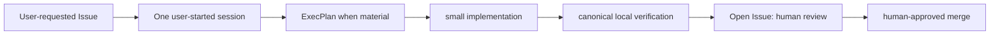

# Development Workflow

**Status:** active template
**Responsible role:** engineering lead
**Update when:** contribution or verification workflow changes.

Work in small changes, use an ExecPlan when the risk test requires one, verify
in the container through `scripts/verify.py`, retain evidence, and use a GitHub
pull request. The Issue execution guidance is canonical in
[GITHUB_ISSUE_WORKFLOW.md](../harness/GITHUB_ISSUE_WORKFLOW.md). No deployment
follows from merge.

## Planning evidence by work size

Choose the smallest durable artifact that makes the work reviewable. These are
planning and review conventions, not a custom scheduler policy or a new
framework.

| Work | Required evidence | Example |
| --- | --- | --- |
| Small, clear maintenance | A GitHub Issue with outcome, non-goals, code packet, acceptance evidence, and exact verification command. No separate specification. | Correcting one documented command and checking its Markdown link. |
| Material feature or integration | The Issue plus a concise specification in `docs/specs/` covering outcome, non-goals, constraints, acceptance scenarios, and verification. | Adding a bounded optional integration with a copied-project configuration path. |
| Risky, cross-cutting, or multi-session work | The concise specification plus a living ExecPlan in `.agent/execplans/` following [.agent/PLANS.md](../../.agent/PLANS.md). | Retiring a runtime, changing an orchestration boundary, or recovering from a host-level incident. |

Use the [Feature Issue template](../../.github/ISSUE_TEMPLATE/feature.md) to
record Issue identity, dependencies, code scope, and evidence. Use
[Definition of Done](../harness/DEFINITION_OF_DONE.md) to decide what real
operational proof is required. The ExecPlan risk test in `.agent/PLANS.md`
governs when the third level is mandatory.

Upstream Symphony receives only the reviewed repository workflow and eligible
Issue context. It does not parse these planning levels, validate a custom
artifact, route work between models, or implement Terra/Astra escalation.
