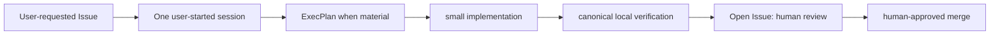

# Development Workflow

**Status:** active template
**Responsible role:** engineering lead
**Update when:** contribution or verification workflow changes.

Work in small changes, use an ExecPlan for material scope, verify in the
container through `scripts/verify.py`, retain evidence, and use a GitHub pull
request. The Issue execution guidance is canonical in
[GITHUB_ISSUE_WORKFLOW.md](../harness/GITHUB_ISSUE_WORKFLOW.md). No deployment
follows from merge.
