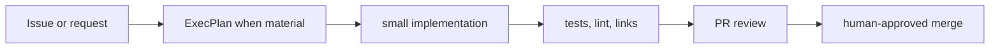

# Development Workflow

**Status:** active template
**Responsible role:** engineering lead
**Update when:** contribution or verification workflow changes.

Work in small changes, use an ExecPlan for material scope, verify in the container, retain evidence, and use a GitHub pull request. No deployment follows from merge.
