# ShortList Release Workflow

**Status:** active, human-authorized manual release workflow
**Responsible role:** release owner
**Update when:** release authority, target, verification, or recovery policy changes.

This workflow governs a release that can affect a public ShortList surface or
an external delivery boundary. It does not make a release automatic. CI, a
passing local check, a Git commit, merge, an ExecPlan, or an Issue comment are
not authority to deploy, change a provider, or send a customer report.

## Release sequence

```mermaid
flowchart LR
  Scope[Approved scope and decision record] --> Build[Implement and verify locally]
  Build --> Review[Human code and evidence review]
  Review --> Authorize[Explicit release authorization]
  Authorize --> Target[Verify deployment target]
  Target --> Deploy[Perform the approved deployment]
  Deploy --> Prove[Exercise the real public boundary]
  Prove --> Record[Record evidence, limits, and recovery status]
```

1. **Record the release scope.** The owning GitHub Issue states the intended
   outcome, non-goals, acceptance evidence, and applicable dependencies. A
   material customer-facing decision belongs in its canonical product document
   and a concise Issue comment. If no owning Issue is identified, record the
   decision in the canonical document but do not infer release authority.
2. **Implement and verify locally.** Follow the development workflow and the
   Definition of Done. Use an ExecPlan when its risk test applies. Record
   relevant tests and honest limitations in the durable work artifact.
3. **Obtain human review.** The release owner reviews the scoped change,
   evidence, configuration impact, and recovery approach. A reviewer may
   decline release even when local checks pass.
4. **Obtain explicit authorization.** Deployment, provider configuration,
   credential use, data migration, customer communication, or a paid-service
   change each need authority appropriate to that action. The authorization
   names the intended target and does not extend to other environments.
5. **Verify the target before action.** Confirm the repository/source identity,
   environment, public hostname or provider account where relevant, and the
   exact deployment or release command. Do not treat a remembered address,
   prior successful release, or generic credential error as target proof.
6. **Deploy only the approved change.** Keep the action narrowly scoped. If a
   prerequisite or target check fails, stop, preserve the evidence, and record
   the blocker instead of substituting an unapproved target or workaround.
7. **Prove the claimed boundary.** Exercise the deployed public interface or
   other real boundary claimed by the release. Record the command or test,
   observed result, date, target, and remaining limitations. If the boundary
   is unavailable, mark the criterion blocked or unobserved rather than passed.
8. **Record recovery readiness.** Record the source/configuration identity and
   the safe rollback or containment action. A failed release uses the incident
   workflow; it is not silently retried outside its authority.

## Customer assessment and PDF delivery boundary

The website assessment journey and report delivery are separate release
boundaries. A customer-facing statement that a report was “sent” means only
that the approved email provider accepted the private attachment; it does not
mean inbox receipt or reading. Do not enable or promise that behaviour until
the provider, private-object, consent, entitlement, retry, and real-boundary
proof requirements in the approved product delivery plan are complete.

Until that boundary is observed, copy must accurately describe the available
experience and must not represent a local preview or an unimplemented provider
path as live delivery.

## CI and review relationship

CI verifies source through the canonical local verification path. It does not
deploy. The exact current CI boundary is maintained in
[CI/CD Strategy](../operations/CI_CD_STRATEGY.md). Pull-request or Issue review
is evidence for a release decision, not a deployment mechanism.

## Related controls

- [Development Workflow](DEVELOPMENT_WORKFLOW.md) — implementation planning,
  verification, and human review.
- [GitHub Issue Workflow](../harness/GITHUB_ISSUE_WORKFLOW.md) — decision and
  evidence record requirements.
- [Definition of Done](../harness/DEFINITION_OF_DONE.md) — real-boundary proof
  and blocked/unobserved criteria.
- [Authority and Guardrails](../harness/AUTHORITY_AND_GUARDRAILS.md) — actions
  that require explicit authority.
- [Delivery Plan](../product/DELIVERY_PLAN.md) — approved product packets and
  their delivery boundaries.
- [Request Flow](../product/REQUEST_FLOW.md) — customer journey and its system
  boundaries; changes to this flow require the release sequence above before
  they can be represented as a public capability.
- [Website Experience](../product/design/WEBSITE_EXPERIENCE.md) — required
  visitor states, consent/confirmation sequence, and truthful-copy boundaries.
- [Incident Workflow](INCIDENT_WORKFLOW.md) — failed-release response.
